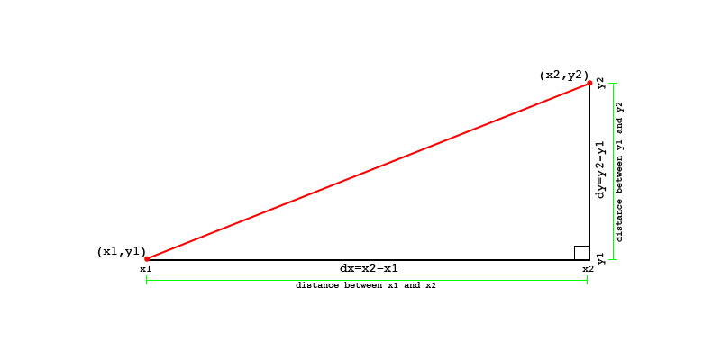

# Calculating Degrees From Two Points

We need a couple bits of information in order to calculate degrees. We need the starting position (`x1,y1`) and the position we want to travel towards (`x2,y2`).

Next we need to calculate the change between the x and y positions. This is often referred to as `dx,dy`. They are calculated separately by taking the position we want to move towards and subtracting the current position. See the image for an illustrated explanation.

	dx = x2 - x1
	dy = y2 - y1

Once you have the dx and dy values you can calculate the angle in radians fairly easy. It is usually calculated as atan(dy / dx) but in python we can use the [math.atan2](https://docs.python.org/2/library/math.html#math.atan2) function.

	radians = math.atan2(dy, dx)

_**NOTE:** This will require that you import the math library into your file using `import math`._

We need to make sure we convert the radians for a full circle. So we need to divide the radians by 2&pi; and keep the remainder, or in other words take radians % 2&pi;. In python &pi; can be represented as [math.pi](https://docs.python.org/2/library/math.html#math.pi).

	radians = radians % 2 * math.pi

Finally we can convert from radians to degrees using the [math.degrees](https://docs.python.org/2/library/math.html#math.degrees) function.

	degrees = math.degrees(radians)

So after working through all that we are left with the following.

	import math

	dx = x2 - x1
	dy = y2 - y1
	radians = math.atan2(dy, dx)
	radians = radians % 2 * math.pi
	degrees = math.degrees(radians)