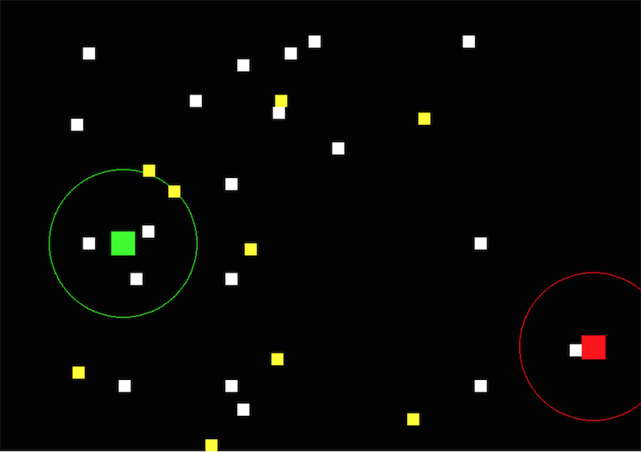

# Range Detection

## Difficulty: Very Easy

A very simple but useful display for you game is adding a simple circle around each player to display the range their missiles can travel. Using the [pygame.draw.circle](https://www.pygame.org/docs/ref/draw.html#pygame.draw.circle) function, you can easily add a circle that looks like the following image. That way you know how far your's and/or an opponent's missiles can travel.

To do this you need to open up the display.py file located at *client_pygame > display > display.py* and modify the `paint_player()` method.

### 1. Get the center point of the player

The `paint_player(self, surface, engine, control, obj)` method receives the player object as its 5th parameter--`obj` which we will use to grab the center point coordinates. Then convert them to integers, make sure you round them first so it goes to the closest integer instead of only truncating them. **(the pygame.draw.circle function can not handle sub pixel measurements)**.

	(x, y) = obj.get_center()
	x = int( round(x) )
	y = int( round(y) )

_**Note:** if that doesn't work you can do the same thing by grabbing the players x and y point position, and their width and height measurements as follows._

	x = obj.get_px() + obj.get_pw()/2
	y = obj.get_py() + obj.get_ph()/2

### 2. Get the missile range of the player

Using the player object `obj` we can get the missile range as follows. Remember to convert it to an integer or pygame will crash.

	missle_range = int( round(obj.get_missile_range()) )

### 3. Draw the circle

Once we have the center position and the range we have everything we need to draw a circle. The `surface` was provided to us as a parameter and we can just use the `color` that was previously calculated for us. *You can create your own color as a tuple with RGB values. `(255, 255, 255)` would be white.*. 

	pygame.draw.circle(surface, color, (x,y), missle_range, 1)

### 4. Finished Code

I added all of the code from above inside the `obj.is_alive()` if statement just after the `pygame.draw.rect()` that draws the player.

	(x, y) = obj.get_center()
	x = int( round(x) )
	y = int( round(y) )
	missle_range = int( round(obj.get_missile_range()) )
	pygame.draw.circle(surface, color, (x,y), missle_range, 1)